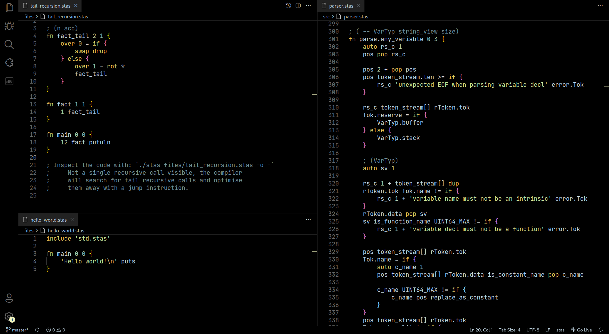
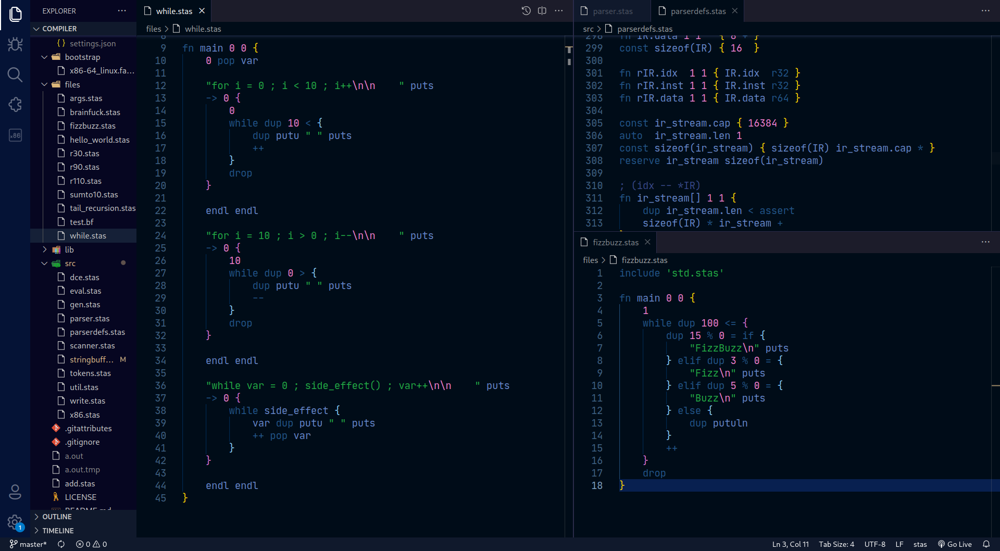

# stas-vscode

This is the Visual Studio Code extension for [stas](https://github.com/l1mey112/stas), a stack based compiled programming language.

Enables support for syntax highlighting.

# Preview

